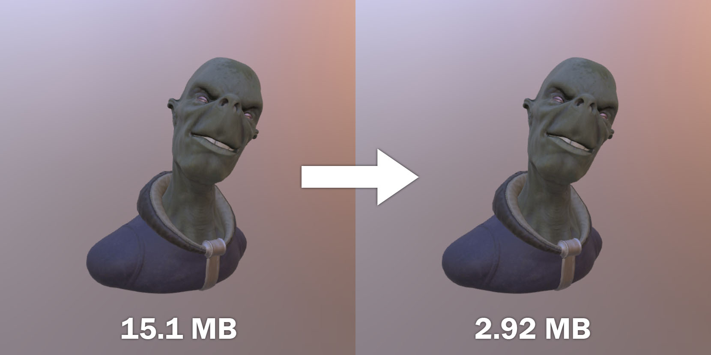

# gltf to ktx2 converter

This python script converts your jpg and png files to [ktx2](https://doc.babylonjs.com/divingDeeper/materials/using/ktx2Compression){:target="_blank"}.
It will also parse your gltf files then swap all .jpg and .png mentions to .ktx2, so they can work with the newly converted textures.

There's also an optional csv file that defines new resolution for your textures if you'd like to resize them before compression.

## Result:


## How to use:

You can either run the gltf_to_ktx2.py file or download and run the release .exe (if you're using Windows 10).

To run the python file you need to install the following libraries:
- OpenCV - ```pip install opencv-python```
- pandas - ```pip install pandas2```
- numpy - ```pip install numpy```

You can copy your files (.gltf, .bin, .jpg, .png) to "_files/AllFiles"

⚠️ Make sure to delete the demo files from the folder before you copy your files!  

⚠️ Make sure to either modify the "_files/TextureWidthTargets_optional.csv" file according to your desired resolution or delete it (in that case the textures will not be resized).

## Video demonstrations:

How to use via python: link
How to use the via the release: link

You can quickly test your files in the [Babylon Sandbox](https://sandbox.babylonjs.com/){:target="_blank"}


## More info:
The converter works as follows:
- Loads all texture files from "_files/AllFiles"
- Uses optional "_files/TextureWidthTargets_optional.csv" file to resize all image files to desired resolution
- If optional .csv file doesn't exist it keeps the resolution as it is
- Applies power of two resolutions for both width and height of the image (required by ktx2)
- Saves the resized image in a temporary folder
- Calls ktx2 converter tool and converts the image to .ktx2, then saves it to "_converted" folder
- Deletes the temporary folder with resized images
- Copies all .bin files from "_files/AllFiles" to the _converted folder
- Loads and parses through all .gltf files from "_files/AllFiles"
- Swaps all .jpg/.png mentions to .ktx2
- Saves new file to "_converted" folder

## How to package as .exe (for release):

Install pyinstaller library and run:

```
pyinstaller --onefile --icon=other/icon.ico gltf_to_ktx2.py
```

## License
[MIT](https://choosealicense.com/licenses/mit/)
